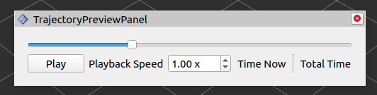

# Trajectory Preview

ROS-enabled Qt widget and Rviz panel for interactively previewing robot trajectories



## Usage
The widget subscribes to a `trajectory_msgs/JointTrajectory` definition of a robot trajectory and 
publishes a `sensor_msgs/JointState` message corresponding to the state in the trajectory at which the slider is set.

An Rviz `RobotModel` display can then be used to visualize the preview using the following pipeline:
  - The trajectory preview widget publishes joint states (`/trajectory/joint_states`)
  - A `JointStatePublisher` node integrates the trajectory preview widget joint states topic (`/trajectory/joint_states`) into a constantly published joint states topic (`/preview/joint_states`)
  - A `RobotStatePublisher` node subscribes to the high-level preview joint states topic (`/preview/joint_states`) and creates a TF tree with the prefix `preview`
  - The Rviz `RobotModel` display animates the robot model using the `preview`-prefixed TF tree
  
This pipeline is provided in the `robot_model_preview_pipeline.launch.xml` file

## Build
```commandLine
cd <ws>
rosdep install --from-paths src -iry
colcon build
```
